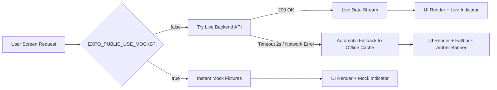

<div align="center">

# 🌾 𝗥𝗜𝗧𝗨𝗖𝗛𝗔𝗞𝗥𝗔 (ऋतुचक्र / ঋতুচক্র) 🌦️
### *Hyperlocal Precision Agro-Meteorological & Climate Intelligence Mobile Platform*

[](https://reactnative.dev/)
[](https://expo.dev/)
[](https://www.typescriptlang.org/)
[](https://tanstack.com/query)
[](https://www.i18next.com/)
[](LICENSE)

<br />

<p align="center">
  <b>Empowering farmers, agri-planners, and rural communities with real-time weather nowcasting, flood tracking, water-balance forecasting, Mandi market pricing, and AI-assisted agricultural advisory.</b>
</p>

---

</div>

## 🌟 Key Highlights & Core Features

```
┌─────────────────────────────────────────────────────────────────────────────┐
│                            RITUCHAKRA MOBILE APP                            │
├─────────────────┬──────────────────┬─────────────────┬──────────────────────┤
│ 🏠 Home         │ 📈 Analytics     │ 📊 Data         │ 💬 AI Advisor        │
│ • Live Sky/Rain │ • Live Storm Grid│ • 7D Forecast   │ • Multilingual Chat  │
│ • Next 6h Bars  │ • Kalman Filter  │ • ET₀ & Water   │ • Preset Prompts     │
│ • High Risk CAP │ • Hugli Tide     │ • Soil Moisture │ • Official Sources   │
│ • Mandi Prices  │ • Onset & Lightning • Flood Alerts │ • Offline Fallback   │
└─────────────────┴──────────────────┴─────────────────┴──────────────────────┘
```

### 📋 Screen Capabilities Matrix

| Screen | Route | Key Data Feeds | Visual Elements | Offline / Mock Support |
| :--- | :--- | :--- | :--- | :---: |
| **Home** | `app/(tabs)/index.tsx` | Sky temp, Rain prob, CAP Hazards, Mandi rates | SVG Bar Charts, Alert Cards, Commodity Grid | ✅ 100% |
| **Analytics** | `app/(tabs)/analytics.tsx` | 7-day forecast, FAO-56 $ET_0$, Soil moisture | 4 SVG Analytic Charts, Summary Table, Flood Badges | ✅ 100% |
| **Data** | `app/(tabs)/data.tsx` | IMD-CAP, GloFAS hydrology, Market prices, AQI | Alerts Grid, Actions Checklist, Market Table & Bar Chart | ✅ 100% |
| **Maps** | `app/(tabs)/maps.tsx` | Station telemetry, Regional radars, River basins | API-less Leaflet map via WebView, Rainviewer, Bhuvan WMS | ✅ 100% |
| **Advisor** | `app/(tabs)/chat.tsx` | Multi-agent agro LLM, Official scientific sources | Central Card UI, Speech bubbles, Preset pills | ✅ 100% |


### 📱 1. 🏠 Home & Dashboard (`/`)
* **Real-time Sky Conditions**: Live temperature, night lows, visibility, and precipitation tracking.
* **Hourly Precipitation Bar Charts**: Interactive SVG visualization of expected rain across the next 6–8 hours.
* **CAP Early Warning Banners**: Instant hazard warnings from IMD-CAP (Extreme rain, lightning pulse, heavy storm).
* **Mandi Market Prices**: Real-time commodity rate trackers (Paddy, Jute, Potato, Mustard, Chilli, etc.) paired with dynamic bar comparisons.

### ⚡ 2. 📈 Analytics & Forecast (`/analytics`)
* **7-Day Agricultural Water Balance**: Daily Max Temp, Precipitation, Probabilities, Reference Evapotranspiration ($ET_0$), and Soil Moisture.
* **Multi-Chart Analytics Suite**:
  - 🌧️ Rain vs. $ET_0$ Combo Charts
  - 🌡️ Temperature Range Curves
  - 🌱 Soil Saturation & Rain Probability Waves
  - ⏱️ Micro-Hourly Breakdown

### 💧 3. 📊 Agro-Climatic Data & Alerts (`/data`)
* **Risks & Actions**: Dynamic prescriptive actions checklist and a comprehensive hazard grid displaying Extreme Warnings, River Flooding, AQI, Marine conditions, and Quakes.
* **Market Price Analysis**: Searchable and interactive datatable for Mandi prices, coupled with a dynamic SVG horizontal bar chart ranking the top 10 most expensive crops.

### 🗺️ 4. 🧭 Hyperlocal Geospatial Map (`/maps`)
* Visual regional hazard maps, satellite radar overlays, and district-level weather station mapping.
* Features a robust **API-less Maps Framework** using **Leaflet.js** sandboxed inside a React Native `WebView`, which eliminates Google Maps API key requirements and guarantees zero native mapping crashes on Android.
* OpenStreetMap basemaps with custom WMS overlay support (ISRO Bhuvan Geomorphology) and live global radar tiles (Rainviewer).

### 🤖 5. 💬 Multilingual AI Agro-Advisor (`/chat`)
* **Seamless Language Switcher**: Switch on-the-fly between **English**, **हिंदी (Hindi)**, and **বাংলা (Bengali)** via pill toggles.
* **Curated Agri-Query Presets**: Instant answers for irrigation advisories, flood rankings, mandi rates, and district outlooks rendered as a grid of quick-action chips.
* **Official Data Provenance**: Transparent links and citations to **IMD**, **Open-Meteo GloFAS**, **CPCB**, and **Agmarknet**.

---

## 🏗️ Architecture & Resilient Data Layer

Rituchakra Mobile features a **3-Tier Resilient Data Strategy** that ensures 100% uptime in low-connectivity rural environments:



---

## 🧮 Agro-Climatic Intelligence & Algorithmic Models

Rituchakra Mobile computes and presents precision agro-meteorological metrics derived from validated open-source meteorological formulations:

### 1. 🌀 Between-Scene Kalman Nowcasting Filter
Calculates smoothed rain-rate transitions ($\hat{x}_k$) between satellite radar scan scenes to predict convective downbursts:
$$\hat{x}_k = \hat{x}_{k|k-1} + K_k \left( z_k - H \hat{x}_{k|k-1} \right)$$
* **Update Interval**: 15-minute INSAT-3D/3DR scan integration
* **Error Correction**: Dynamic Kalman Gain ($K_k$) adjusted against local AWS (Automatic Weather Station) ground sensors

### 2. ☀️ FAO-56 Penman-Monteith Evapotranspiration ($ET_0$)
Provides field-level reference crop water consumption for scientific irrigation scheduling:
$$ET_0 = \frac{0.408 \Delta (R_n - G) + \gamma \frac{900}{T + 273} u_2 (e_s - e_a)}{\Delta + \gamma (1 + 0.34 u_2)}$$
* **Inputs**: Solar radiation ($R_n$), Air Temp ($T$), Wind Speed ($u_2$ at 2m), Vapor Deficit ($e_s - e_a$)
* **Agri Guidance**: Recommends `IRRIGATE: NO` when $P_{\text{eff}} \ge ET_0$ over consecutive days

### 3. 🌊 GloFAS River Basin Discharge & Ponding Index
* Multi-point hydrological runoff model comparing river stage height against historical flood quantiles.


---

## 📂 Project Structure

```
rituchakra-mobile/
├── 📁 app/                     # Expo Router File-Based Navigation
│   ├── 📄 _layout.tsx          # Root Layout (QueryClient & i18n initialization)
│   └── 📁 (tabs)/              # 5 Core Navigation Tabs
│       ├── 📄 _layout.tsx      # Bottom Tab Bar configuration & Lucide icons
│       ├── 📄 index.tsx        # Home Screen (Sky, Warnings, Mandi Market)
│       ├── 📄 analytics.tsx    # Storm Matrix & Kalman Chart Screen
│       ├── 📄 maps.tsx         # Geospatial Map View Screen (Leaflet WebView)
│       ├── 📄 data.tsx         # 7-Day Forecast, ET₀ & Soil Water Balance
│       └── 📄 chat.tsx         # Multilingual AI Advisor Screen
├── 📁 src/
│   ├── 📁 api/                 # API Client with Promise.race Fallback Engine
│   │   └── 📄 client.ts        # TanStack Query hooks & resilient fetch
│   ├── 📁 components/          # Reusable UI Atoms & Components
│   │   └── 📄 MockBanner.tsx   # Offline/Mock status banner
│   ├── 📁 i18n/                # Multi-language internationalization
│   │   └── 📄 index.ts         # English, Hindi, and Bengali translation keys
│   ├── 📁 mocks/               # Domain Mock Fixtures
│   ├── 📁 theme/               # Design Tokens & Palette
│   │   └── 📄 tokens.ts        # Colors, Typography, Spacing, Elevation
│   └── 📁 types/               # TypeScript Domain Interfaces
│       └── 📄 index.ts
├── 📄 app.config.ts            # Expo configuration
├── 📄 package.json             # Dependencies & scripts
└── 📄 tsconfig.json            # Strict TypeScript configuration
```

---

## 🛠️ Tech Stack & Libraries

* **Framework**: [Expo](https://expo.dev/) (SDK 51) with [Expo Router v3](https://docs.expo.dev/router/introduction/)
* **Language**: [TypeScript](https://www.typescriptlang.org/)
* **State & Server Cache**: [TanStack Query v5](https://tanstack.com/query) (`@tanstack/react-query`)
* **Vector Graphics & Visuals**: [react-native-svg](https://github.com/software-mansion/react-native-svg)
* **Iconography**: [lucide-react-native](https://lucide.dev/)
* **Localization**: [i18next](https://www.i18next.com/) & [react-i18next](https://react.i18next.com/)
* **Safe Area Handling**: [react-native-safe-area-context](https://github.com/th3rdwave/react-native-safe-area-context)
* **Map Framework**: [react-native-webview](https://github.com/react-native-webview/react-native-webview) rendering API-less [Leaflet.js](https://leafletjs.com/)

---

## 🚀 Getting Started & Local Development

### 1. Clone the Repository
```bash
git clone https://github.com/LuchaLibreAAA/Rituchakra-App.git
cd Rituchakra-App
```

### 2. Install Dependencies
```bash
npm install
```

### 3. Configure Environment Variables
Create a `.env` file in the root directory:
```env
EXPO_PUBLIC_API_BASE=https://api.domain.com
EXPO_PUBLIC_DEFAULT_LAT=22.0667
EXPO_PUBLIC_DEFAULT_LON=88.0698
EXPO_PUBLIC_USE_MOCKS=true
```

### 4. Run Development Server
```bash
# Start with clean cache
npx expo start -c

# Run on Android emulator / device
npm run android

# Run on iOS simulator / device
npm run ios

# Run on Web browser
npx expo start --web
```

---

## 🤝 Contribution Guidelines & Development Standards

We welcome contributions from meteorologists, software engineers, and agro-specialists!

1. **Branching Strategy**:
   - `main`: Production-ready releases
   - `feat/<feature-name>`: New capabilities (e.g., `feat/offline-sqlite`)
   - `fix/<bug-name>`: Bug fixes and performance patches

2. **Commit Conventions**:
   Follow [Conventional Commits](https://www.conventionalcommits.org/):
   - `feat:` New UI screen or algorithmic metric
   - `fix:` Bug fix or rendering resolution
   - `docs:` Documentation or README updates
   - `refactor:` Code restructuring without logic changes

3. **Type Safety & Linting**:
   Ensure zero TypeScript compilation errors before filing a Pull Request:
   ```bash
   npx tsc --noEmit
   ```

---

## 🗺️ Future Roadmap & Native Horizons
- [ ] **Phase 2 — UI IS Subject to updation**: Direct Bluetooth pairing with solar-powered farm rain gauges and soil tensiometers.
- [ ] **Phase 2 — Offline SQLite & Vector Store**: On-device caching of 30-day historical agro-weather telemetry for zero-network field work.
- [ ] **Phase 3 — Native Android Weather Widget**: Glanceable home screen widgets displaying real-time downburst alerts and $ET_0$ water balance.
- [ ] **Phase 4 — Audio Voice Advisory Engine**: Voice-in / Voice-out conversational AI advisor in regional dialects (Bangla & Rural Hindi) for improved accessibility.
- [ ] **Phase 5 — Bluetooth LoRa / BLE Field Sensor Sync**: Direct Bluetooth pairing with solar-powered farm rain gauges and soil tensiometers.


---

## 🌐 Official Data Providers & References
* 🛰️ **IMD**: India Meteorological Department Weather Forecasts & CAP Alerts
* 🌊 **Open-Meteo GloFAS**: Global Flood Awareness & Discharge APIs
* 💨 **CPCB**: Central Pollution Control Board (Real-time AQI)
* 🌾 **Agmarknet**: Ministry of Agriculture & Farmers Welfare (Mandi Prices)
* 🌍 **USGS**: Earthquake Hazards Program (FDSN)

---

<div align="center">
  <sub>Built with ❤️ for Indian Agriculture and Resilient Climate Communities.</sub>
</div>
